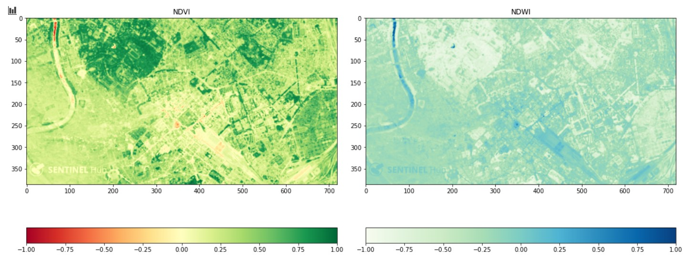
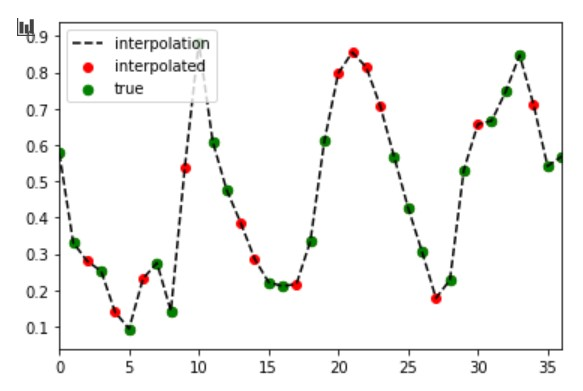
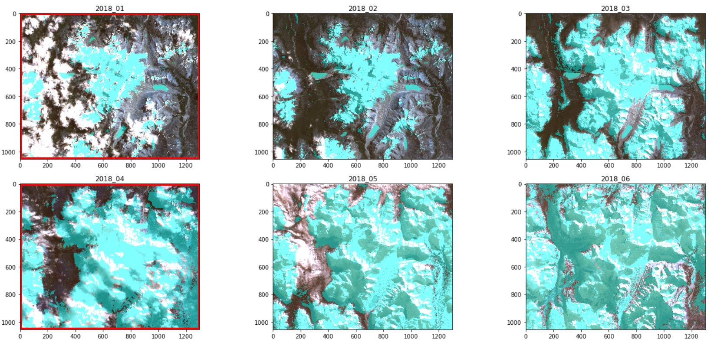

# Python for Earth Oservation

This Repository is for playing around with Python for Satellite Data analysis. 
By using freely available Sentintinel-2 data, a few applications are axplored in jupyter notebooks here. The Sentinel-2 data ist multi-spectral, making 12 bands from visible light to infrared available for investigation. By combining these bands in different combinations use cases from snow detection, over vegetation monitoring to extracting urban features can be analysed.

These notebooks are currently in this repository:

- [Python for Raster Analysis](PythonforRasterAnalysis.ipynb)
- [Raster Time Series Interpolation](RasterTimeseriesInterpolation.ipynb)

The repositories are all just a playground, so they are constantly work in progress and there might be more elegant ways of using the problems, so don't be to harsh on judgemtns and please let me know if you have ideas on how to improve the scripts ;)

## Python for Raster Analysis
Contains the basic functionality of how to read raster data into python and perform raster calculations and visualization.

  

__________________________________________________________________________________________________________

## Time Series Interpolations
This notebook suggests a way to temp-spatially interpolate satellite data for missing scenes due to cloud cover. By calculation the NDSI (Normalized Difference Snow index) over  "Cerro San Lorenzo" at the border between Argentina and Chile. the average snow cover per month is calculated.

As some months are not in the data set due to heavy cloud cover, the graph shows gaps. These can be calculated by a spline interpolation

  

For further spatial analysis, however,  the actual raster mask of snow cover may be needed and this is where the spatial aspect of this interpolation approach comes into play. By taking the total snow cover values from the graph interpolation. The new raster will be created accordingly.

  

Further Earth Observation Applications can be found here:

- [Crop Classification](https://github.com/RomanPCML/EarthObservation)
